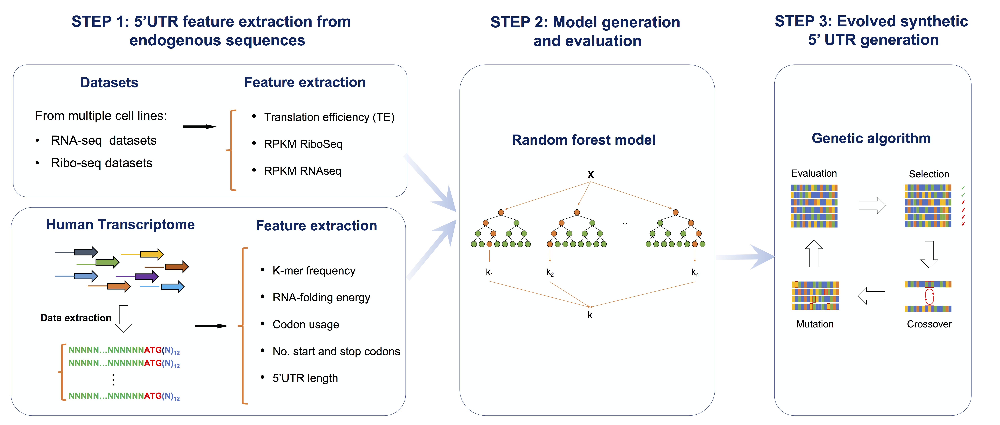

# Design of evolved synthetic 5'UTR sequences for enhanced protein production

The goal of this workflow is to generate novel 5'UTR sequences with optimized features to maximize the translation efficiency of the constructs. 
This is achieved in 3 steps:

- Step 1. **Feature extraction** from endogenous sequences 
- Step 2. **Random Forest model generation** and evaluation, using extracted features to predict Translation Efficiency (TE)
- Step 3. Generation of novel **'evolved' sequences using a Genetic Algorithm** 

This repository is the code accompanying the paper:High-Throughput 5’ UTR Engineering for Enhanced Protein Production in Non-Viral Gene Therapies. Jicong Cao*, Eva Maria Novoa*, Zhizhuo Zhang*, William C.W. Chen, Dianbo Liu, Gigi C G Choi, Alan S L Wong, Claudia Wehrspaun, Manolis Kellis, Timothy K Lu. bioRxiv 2020. doi: https://doi.org/10.1101/2020.03.24.006486





## Table of Contents
- [Step 1. Design of 5'UTR sequences](#Step-1.-Design-of-5'UTR-sequences)
- [Step 2. 5'UTR model generation and evaluation](#Step-2.-5'UTR-model-generation-and-evaluation)
- [Step 3. Generation of novel evolved 5'UTR sequences](#Step-3.-Generation-of-novel-evolved-5'UTR-sequences)
- [Running individual scripts for each of the steps performed](#Running-individual-scripts-for-each-of-the-steps-performed)
- [Additional data sources](#Additional-data-sources)
- [Dependencies and versions](#Dependencies-and-versions)
- [Citation](#Citation) 
- [Contact](#Contact) 
 

## Step 1. Feature extraction of 5'UTR sequences 

**Goal**: Extract features that correspond to optimal 5'UTRs to maximize the translation efficiency (TE).

Features used in Random Forest model training:
- Kmer-frequency: k=1-6
- RNAfolding energy for first 100bp, last 30bp(15bp UTR+ 15bp CDS), whole (5UTR+15bp CDS), 5UTR only, with/without consdiering G-quadruplex 
- codon usage
- number of start and stop codon in UTR
- 5'UTR length

### Running the code: 
``` 
HERE DETAILS TO BE FILLED IN BY ZHIZHUO
```


## Step 2. 5'UTR model generation and evaluation

**Goal**: Generate and evaluate model  features that correspond to optimal 5'UTRs to maximize the translation efficiency (TE).

**Algorithm used**: **Random Forest** to build a prediction model 

The model trained for human sequences is available as part of this repository. 
Results: Using 10-fold cross-validation, we obtained  0.71 pearson correlation in TE prediction, and 0.74 in RNA expression prediction.

### Running the code: 
``` 
HERE DETAILS TO BE FILLED IN BY ZHIZHUO
```


## Step 3. Generation of novel evolved 5'UTR sequences

**Goal**: Evolve endogenous 5'UTR sequences to obtain 5'UTRs with increased translation efficiency

**Algorithm used**: **Genetic Algorithm (GA)**

Additional details of individual steps are described in `makefile` file)

#### Running the code:
```
ZHIZHUO TO FILL IN 
```

## Running individual scripts for each of the steps performed: 

- 1. Extract DNA sequence 5'UTR+first CDS
``` 
make output/gencode_v17_5utr_15bpcds.fa
```

- 2. Compute sequence feature
``` 
use .viennarna-2.1.9
use .biopython-1.64-python-2.7.1-sqlite3-rtrees
make output/gencode_v17_5utr_15bpcds.fa.sparseFeature.txt.gz
``` 
- 3. Build prediction model for TE and Ribo-seq expression
``` 
make output/gencode_v17_5utr_15bpcds.fa.model
``` 
- 4. Design optimal 100bp 5UTR sequence for maximizing TE
``` 
make all_evojob.TE
``` 
- 5. Design optimal 100bp 5UTR sequence for maximizing Ribo-seq expression
``` make all_evojob.Ribo
``` 
- 6. Select diverse optimized sequences for 5'UTR synthesis 
``` 
make all_seljob
make output/final/synthetic3K.txt
``` 


## Additional data sources 

- df_counts_and_len.TE_sorted.with_annot.txt: Muscle RNA-seq and Ribo-seq data from publicly available datasets (PC3, HEK and muscle)
- entiredata_2015_12_25_3-25_pm: RNA binding motif, downloaded from http://cisbp-rna.ccbr.utoronto.ca/
 
## Dependencies and versions

** ZHIZHUO TO FILL IN ** 

## Citation
If you find this work useful, please cite: 

High-Throughput 5’ UTR Engineering for Enhanced Protein Production in Non-Viral Gene Therapies. Jicong Cao*, Eva Maria Novoa*, Zhizhuo Zhang*, William C.W. Chen, Dianbo Liu, Gigi C G Choi, Alan S L Wong, Claudia Wehrspaun, Manolis Kellis, Timothy K Lu. bioRxiv 2020. doi: https://doi.org/10.1101/2020.03.24.006486


## Contact
If you have any issues using this code, please open an Issue in the GitHub repository. Thanks!


#### Last Updated: February 2021

